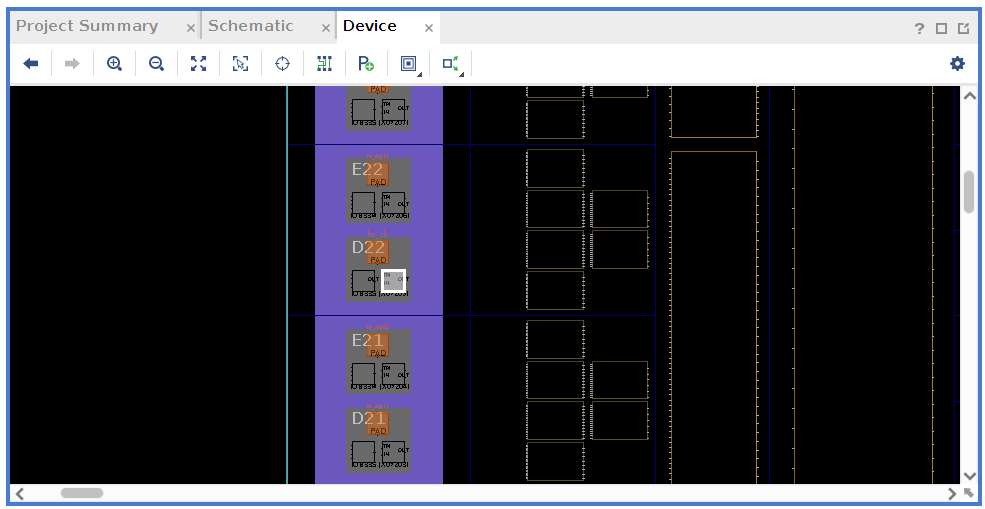
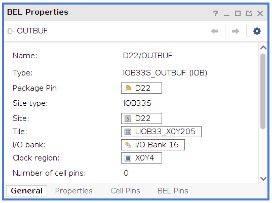

# Porting guidelines

This page describes steps you need to take in order to incorporate this
HyperRAM controller into your design.

The Example Design uses the Artix 7 FPGA from Xilinx.  However, the controller
has been written in pure RTL (i.e. as portable as possible), making use of only
rising edge flip flops and no other IP blocks. It should therefore be a
relatively easy task to port this project to other FPGAs, even other vendors as
well, e.g. Lattice or Intel.

When porting the HyperRAM controller to your own project, there are three key
points to consider:

* Tri-state buffering
* Clocking
* Constraints


## Tri-state buffering

The HyperRAM device uses bidirectional ports, and this requires I/O buffers
with tri-state capability for the wires `RWDS` and `DQ`. Vivado can
automatically infer tri-state buffers when assigning `'Z'` to a port declared
as `inout`.  It is good design practice to infer the tri-state buffers from the
top-level file. Therefore, this HyperRAM controller does not itself infer any
tri-state buffers. Instead, it contains three signals for each of the `RWDS` and
`DQ` wires: One for input, one for output, and one for output enable.

In the top-level file of your own project you should include the following lines:

```
hr_rwds_io <= hr_rwds_out when hr_rwds_oe = '1' else 'Z';
hr_dq_io   <= hr_dq_out   when hr_dq_oe   = '1' else (others => 'Z');
hr_rwds_in <= hr_rwds_io;
hr_dq_in   <= hr_dq_io;
```

Here `hr_rwds_io` and `hr_dq_io` are the external ports connected to the HyperRAM
device.


## Clocking

The HyperRAM implementation requires a total of three clocks:

* `clk_i`        : This runs at 100 MHz, and drives the Avalon MM interface as
  well as the HyperRAM speed.
* `clk_x2_i`     : This runs at 200 Mhz and must be synchronous to `clk_i` with
  no phase shift.
* `clk_x2_del_i` : This runs at 200 Mhz and must be synchronous to `clk_i` with
  a specific phase shift.

All three clocks should be generated from the same MMCM/PLL.

The reason for the phase-shifted clock is to ensure correct timing when
sampling the input date `DQ` from the HyperRAM. For more information, see
[Detailed design description](src/hyperram/README.md#hyperram_io.vhd).

The specific value of the phase shift for `clk_x2_del_i` is board and device
dependent. To determine the value to use probably requires some hand tuning,
i.e. experimentally trying different values to find a range where there are no
errors.

On the MEGA65 platform I've had success with phase shifts in the range 144 to
180 degrees, and have therefore settled on the central value of 162 degrees.

See the file [src/Example_Design/clk.vhd](src/Example_Design/clk.vhd) for how
clock synthesis is done on the MEGA65.


## Constraints

My experiments have shown that the HyperRAM timing is very sensitive to
variations in design placement within the FPGA. Incorrect or sub-optimal
placement can lead to large routing delays inside the FPGA that can interfere
with the HyperRAM timing.  Therefore it is necessary to constrain the design so
that the HyperRAM controller is placed as close to the I/O pads as possible.
I've found it convenient to use `pblocks`.

On the MEGA65 the HyperRAM signals are located in the upper left corner of the
FPGA, i.e. from X0Y200 to X0Y224. To make room for the HyperRAM controller,
it is constrained to a small region close to these I/O pads. I've chosen the
region X0Y200 to X7Y224, seen in lines 62-67 in the file top.xdc:

```
# Place HyperRAM close to I/O pins
startgroup
create_pblock pblock_i_hyperram
resize_pblock pblock_i_hyperram -add {SLICE_X0Y200:SLICE_X7Y224}
add_cells_to_pblock pblock_i_hyperram [get_cells [list i_hyperram]]
endgroup
```

With this single constraint Vivado consistently places the HyperRAM controller
right next to the corresponding I/O ports.

There are other means of coercing Vivado to place the HyperRAM controller
correctly, e.g. by setting appropriate input and output delays, but I was not
successfull with that approach.

### Locating the I/O pad

To determine the correct constraint to use I first located the I/O pin D22 (for
the top-level signal `CK`) in the device view in Vivado:



Then selecting the pin and viewing the pin properties gives this result:



From the line "Tile:" we directly see the value X=0 and Y=205. Then just repeat
with the other top-level ports connected to the HyperRAM device.

