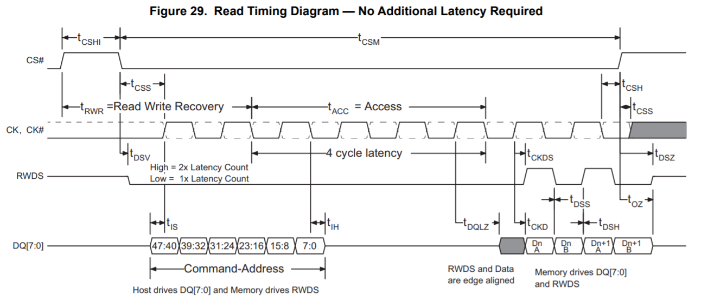
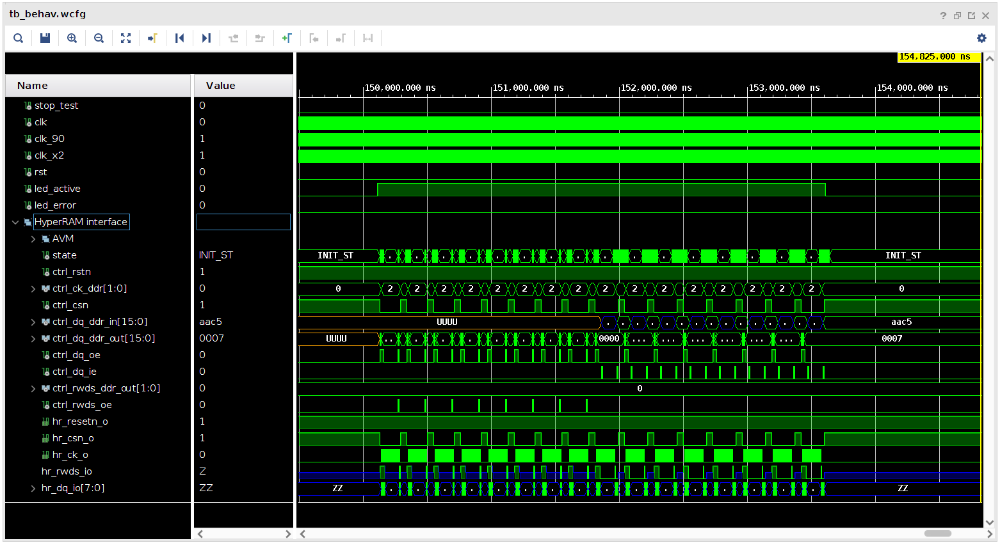

# HyperRAM

This repository is my attempt at a portable HyperRAM controller.  I've looked
at several other implementations, and they all seemed lacking in various
regards.

I'm testing my HyperRAM controller on the [MEGA65](https://mega65.org/)
hardware platform (revision 3).  It contains the [8 MB
HyperRAM](doc/66-67WVH8M8ALL-BLL-938852.pdf) chip from ISSI (Integrated Silicon
Solution Inc.).  Specifically, the part number of the HyperRAM device is
`IS66WVH8M8BLL-100B1LI`, which indicates a 64 Mbit, 100 MHz version with 3.0 V
supply and a single-ended clock.

The HyperRAM controller in this repository is a complete rewrite from scratch,
and is provided with a [MIT license](LICENSE).


## Testing in simulation

In order to test my HyperRAM controller I've found a [simulation
model](HyperRAM_Simulation_Model) (downloaded from
[Cypress](https://www.cypress.com/documentation/models/verilog/verilog-model-hyperbus-interface))
of a real [Cypress HyperRAM device](doc/s27kl0642.pdf).

Using a (presumably correct) simulation model is vital when developing. Because
this allows testing the implementation in simulation, and thus finding and
fixing bugs much faster.

## Timing constraints

Since the HyperRAM in the MEGA65 is a different device (and with
different timings) than the above mentioned simulation model, I've modified the
simulation model by adding timing values (and default configuration values)
specific for the MEGA65 HyperRAM device, see lines 219-249 in
[HyperRAM\_Simulation\_Model/s27kl0642.v](HyperRAM_Simulation_Model/s27kl0642.v)

The timing parameters are given in the table below (taken from the
[documentation](doc/66-67WVH8M8ALL-BLL-938852.pdf)):

```
Parameter                                | Symbol | Min  | Max  | Unit
Chip Select High Between Transactions    | t_CSHI | 10.0 |  -   | ns
HyperRAM Read-Write Recovery Time        | t_RWR  | 40   |  -   | ns
Chip Select Setup to next CK Rising Edge | t_CSS  |  3   |  -   | ns
Data Strobe Valid                        | t_DSV  |  -   | 12   | ns
Input Setup                              | t_IS   |  1.0 |  -   | ns
Input Hold                               | t_IH   |  1.0 |  -   | ns
HyperRAM Read Initial Access Time        | t_ACC  | 40   |  -   | ns
Clock to DQs Low Z                       | t_DQLZ |  0   |  -   | ns
HyperRAM CK transition to DQ Valid       | t_CKD  |  1   |  7   | ns
HyperRAM CK transition to DQ Invalid     | t_CKDI |  0.5 |  5.2 | ns
Data Valid                               | t_DV   |  2.7 |  -   | ns
CK transition to RWDS valid              | t_CKDS |  1   |  7   | ns
RWDS transition to DQ Valid              | t_DSS  | -0.8 |  0.8 | ns
RWDS transition to DQ Invalid            | t_DSH  | -0.8 |  0.8 | ns
Chip Select Hold After CK Falling Edge   | t_CSH  | 0    |  -   | ns
Chip Select Inactive to RWDS High-Z      | t_DSZ  | -    |  7   | ns
Chip Select Inactive to DQ High-Z        | t_OZ   | -    |  7   | ns
HyperRAM Chip Select Maximum Low Time    | t_CSM  | -    |  4.0 | us
Refresh Time                             | t_RFH  | 40   |  -   | ns
```

The symbol names refer to the following figure (taken from the [Cypress HyperRAM datasheet](doc/s27kl0642.pdf)):



## Overview of project contents

This project contains the following:

* Main HyperRAM controller
* Traffic generator

This is all that is needed to verify the implementation in simulation.

### Main HyperRAM controller

I've split the HyperRAM controller implementation into two parts:

* The state machine ([hyperram\_ctrl.vhd](hyperram_ctrl.vhd)), running in a
  single clock domain, same as HyperRAM device, i.e. 100 MHz.
* The I/O ports ([hyperram\_io.vhd](hyperram_io.vhd)), using an additional
  clock at double-speed (200 MHz) for correct timing of the HyperRAM signals.

The phase shifted clock is used to delay the HyperRAM clock signal `CK`
relative to the transitions on the `DQ` signal. This ensures correct values of
the timing parameters `t_IS` and `t_IH` during WRITE operation.

The double-speed clock is used to manually sample the `DQ` signal during READ
operation.

The user interface to the HyperRAM controller is a 16-bit Avalon Memory Map
interface with support for burst operations, see
[doc/Avalon\_Interface\_Specifications.pdf](doc/Avalon_Interface_Specifications.pdf).
This is a very common bus interface, and quite easy to use.

### Traffic generator

The traffic generator's sole purpose is to test the HyperRAM controller. It
does this by generating first a sequence of WRITE operations (writing
pseudo-random data to the entire HyperRAM device), and then a corresponding
sequence of READ operations, verifying that the correct values are read back
again.

The traffic generator has a single control input (`start_i`) that starts the above mentioned
process. There are two output signals indicating progress:

* `led_active`: indicates the test is in progress.
* `led_error`: indicates at least one error has occurred.


## Running simulation

To perform the simulation test just start up Vivado, load the project file
[top.xpr](top.xpr), and select "Run Simulation".

This generates the following waveform:


In simulation mode, only 8 writes and 8 reads are performed, to keep the
simulation time reasonable. The above waveform shows these 16 transactions.
Specifically, at the top we see `led_active` being first asserted and then
de-asserted, while `led_error` remains de-asserted all the time.


## Testing on the MEGA65 hardware platform

In order to make use of the MEGA65 hardware platform we need to generate the
necessary clocks, and some way to start the test and see the result.

This section discusses the following:

* Clock synthesis
* MEGA65-specific support files

### Clock synthesis

As mentioned previously, controlling the physical I/O to the HyperRAM device
requires an additional clock (at twice the frequency) to get the correct timing.

This double-speed clock is generated using a single MMCM. This is done in the file
[src/MEGA65/clk.vhd](src/MEGA65/clk.vhd).

This file also generates a 40 MHz clock, but this is only used by the support files
needed for the MEGA65.

### MEGA65-specific support files

The MEGA65 comes with a keyboard and two visible LED's. In order to make use of
these I've copied the file `mega65kbd_to_matrix.vhdl` from the [MEGA65
project](https://github.com/MEGA65/mega65-core) and removed stuff I didn't need.

In this way, I can start the test by pressing the `RETURN` key, and I can watch
the progress of the test on the `POWER` LED and look for any errors on the
`Floppy` LED. The entire test runs for approximately 2 seconds.


