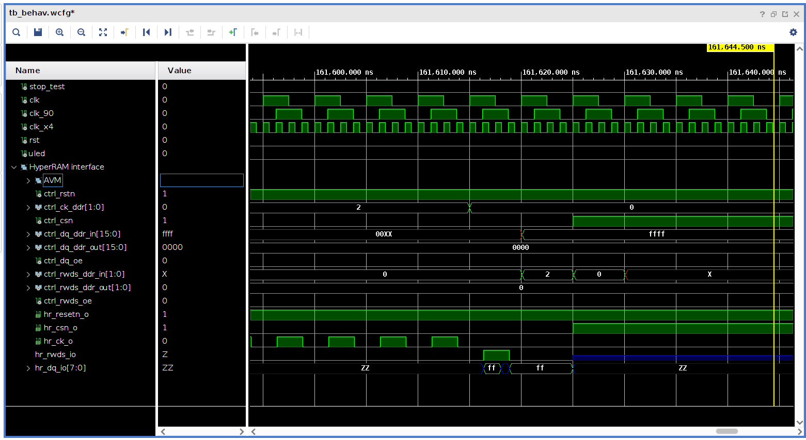

# HyperRAM

This repository is my attempt at a HyperRAM controller for the Xilinx Artix 7
FPGA.

I've looked at several other implementations, and they all seemed lacking in
various regards.

So this is a complete rewrite from scratch, and it's provided with a
[MIT license](LICENSE).


## Testing in simulation

In order to test my HyperRAM controller I've found a [simulation
model](HyperRAM_Simulation_Model) (downloaded from
[Cypress](https://www.cypress.com/documentation/models/verilog/verilog-model-hyperbus-interface)).

Using a (presumably correct) simulation model is vital when developing. Because
this allows testing the implementation in simulation, and thus finding and
fixing bugs much faster.


## Testing on hardware

I'm testing my HyperRAM controller on the [MEGA65](https://mega65.org/)
hardware platform.  It contains the [8 MB HyperRAM
chip](doc/66-67WVH8M8ALL-BLL-938852.pdf) from ISSI (Integrated Silicon Solution
Inc.).  Specifically, the part number is `IS66WVH8M8BLL-100B1LI`, which
indicates a 3.0 V 100 MHz version.

Note that this device is different from the simulation model. So I need to
update the simulation with the timing characteristice of this particular
device.

## Design notes

I've split the controller implementation into two parts:

* The state machine, running in a single clock domain.
* The I/O ports, using multiple additional clocks for correct timing.

The most complicated part is when to sample the DQ signal upon read.  Since
RWDS and DQ change synchronously, the solution I've decided on is to delay the
RWDS signal by a quarter clock cycle, and then use that as a clock to sample
the DQ signal. It remains to be seen, whether this is a stable solution.

## Timing diagram

In simulation I've generated the following waveform


## Timing constraints

The timing parameters are given in the table below:

```
Parameter                                | Symbol | Min  | Max  | Unit
Chip Select High Between Transactions    | t_CSHI | 10.0 |  -   | ns
HyperRAM Read-Write Recovery Time        | t_RWR  | 40   |  -   | ns
Chip Select Setup to next CK Rising Edge | t_CSS  |  3   |  -   | ns
Data Strobe Valid                        | t_DSV  |  -   | 12   | ns
Input Setup                              | t_IS   |  1.0 |  -   | ns
Input Hold                               | t_IH   |  1.0 |  -   | ns
HyperRAM Read Initial Access Time        | t_ACC  | 40   |  -   | ns
Clock to DQs Low Z                       | t_DQLZ |  0   |  -   | ns
HyperRAM CK transition to DQ Valid       | t_CKD  |  1   |  7   | ns
HyperRAM CK transition to DQ Invalid     | t_CKDI |  0.5 |  5.2 | ns
Data Valid                               | t_DV   |  2.7 |  -   | ns
CK transition to RWDS valid              | t_CKDS |  1   |  7   | ns
RWDS transition to DQ Valid              | t_DSS  | -0.8 |  0.8 | ns
RWDS transition to DQ Invalid            | t_DSH  | -0.8 |  0.8 | ns
Chip Select Hold After CK Falling Edge   | t_CSH  | 0    |  -   | ns
Chip Select Inactive to RWDS High-Z      | t_DSZ  | -    |  7   | ns
Chip Select Inactive to DQ High-Z        | t_OZ   | -    |  7   | ns
HyperRAM Chip Select Maximum Low Time    | t_CSM  | -    |  4.0 | us
Refresh Time                             | t_RFH  | 40   |  -   | ns
```

The symbol names refer to the following figure:


