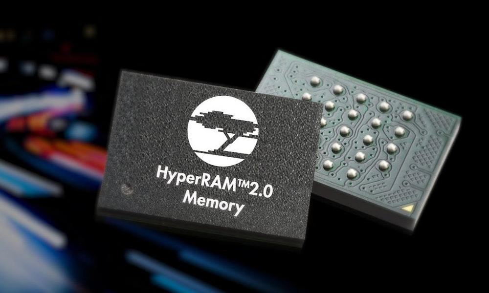

## Portable OpenSource HyperRAM controller for FPGAs written in VHDL

HyperRAM is quite a beast! On the one hand, it offers advantages to hardware designers such as
low pin count, low power consumption and easy control. At least compared to modern DDR alternatives.
On the other hand, there are tons of nitty gritty details you need to know and take care of to
create a stable and realiable HyperRAM controller. Complex constraints and nasty phase shifts
just to name two of them.



Therefore you do not want to reinvent the wheel and go through the joy and pain of implementing
a HyperRAM controller from scratch. Search no longer! You have found what you are looking
for: The [MJoergen/HyperRAM](https://github.com/MJoergen/HyperRAM) controller has the following
advantages:

* Easy to use
* Well documented
* Field proven stability
* Portable
* OpenSource: Very permissive [MIT license](https://github.com/MJoergen/HyperRAM/blob/main/LICENSE) that also allows commercial use

The controller is written in modern **VHDL-2008** and you can of course use it without
any modifications in your **Verilog** Designs.

It has been written and tested on a Xilinx Artix-7 FPGA using Vivado. Due to the portable
nature of the controller in conjunction with the well documented code and constraints file
you can easily port it to other environments such as Intel and Quartus.

### Features

* Maximum HyperRAM clock speed of 100 MHz
* Variable latency
* Configuration registers read and write
* Identification registers read
* Automatic configuration of latency mode upon reset
* 16-bit Avalon Memory Map interface including burst mode

### Getting started

The [MJoergen/HyperRAM](https://github.com/MJoergen/HyperRAM) GitHub repository contains
a detailed documentation of how to get started including a reference implementation /
example design for the [MEGA65](https://www.mega65.org).

If you just need a quick overview of the HyperRAM controller's interface to check, if
this design is for you, then scroll down to the "Interface" section.

Otherwise, here is the best way to get started with the HyperRAM controller:

The [HyperRAM controller](https://github.com/MJoergen/HyperRAM/blob/main/src/hyperram/hyperram.vhd)
has just two interfaces, one for the external HyperRAM device and one for the client (user) of the
HyperRAM. For the client interface I've chosen the
[Avalon MemoryMap]((https://github.com/MJoergen/HyperRAM/blob/main/doc/Avalon_Interface_Specifications.pdf)
protocol. This is an industry standard and is easy to use. The interface width
is 16 bits corresponding to one word of the HyperRAM.
The addressing is in units of words, not bytes.

To see an example of how to use the HyperRAM controller and how to connect it
to the internal FPGA logic and to the external HyperRAM device, have a look at
the [Example_Design](https://github.com/MJoergen/HyperRAM/tree/main/src/Example_Design),
specifically at the [top levelfile](https://github.com/MJoergen/HyperRAM/blob/main/src/Example_Design/top.vhd)
and the [trafic generator](https://github.com/MJoergen/HyperRAM/blob/main/src/Example_Design/trafic_gen.vhd).

The HyperRAM controller is written in a portable way. Here is further reading, if you
want to understand more and/or port the controller to your specific design:

* [Porting guideline](https://github.com/MJoergen/HyperRAM/blob/main/PORTING.md)
* [Detailed design description](https://github.com/MJoergen/HyperRAM/blob/main/src/hyperram/README.md)
* [Simulation](https://github.com/MJoergen/HyperRAM/tree/main/simulation)

### Interface

Here is a sneak preview in VHDL of how the HyperRAM controller's interface looks like
including a quick explanation of the Avalon Memory Map interface.

```vhdl
entity hyperram is
   port (
      clk_x1_i            : in  std_logic; -- Main clock
      clk_x2_i            : in  std_logic; -- Physical I/O only
      clk_x2_del_i        : in  std_logic; -- Double frequency, phase shifted
      rst_i               : in  std_logic; -- Synchronous reset

      -- Avalon Memory Map
      avm_write_i         : in  std_logic;
      avm_read_i          : in  std_logic;
      avm_address_i       : in  std_logic_vector(31 downto 0);
      avm_writedata_i     : in  std_logic_vector(15 downto 0);
      avm_byteenable_i    : in  std_logic_vector(1 downto 0);
      avm_burstcount_i    : in  std_logic_vector(7 downto 0);
      avm_readdata_o      : out std_logic_vector(15 downto 0);
      avm_readdatavalid_o : out std_logic;
      avm_waitrequest_o   : out std_logic;

      -- HyperRAM device interface
      hr_resetn_o         : out std_logic;
      hr_csn_o            : out std_logic;
      hr_ck_o             : out std_logic;
      hr_rwds_in_i        : in  std_logic;
      hr_rwds_out_o       : out std_logic;
      hr_rwds_oe_o        : out std_logic;   -- Output enable for RWDS
      hr_dq_in_i          : in  std_logic_vector(7 downto 0);
      hr_dq_out_o         : out std_logic_vector(7 downto 0);
      hr_dq_oe_o          : out std_logic    -- Output enable for DQ
   );
end entity hyperram;
```

**Avalon Memory Map interface**

Here is a brief summary of the signals involved in the Avalon Memory Map
interface. For your convenience, the repository contains the full
[specification](https://github.com/MJoergen/HyperRAM/blob/main/doc/Avalon_Interface_Specifications.pdf)
as a downloadable PDF. But don't worry: You do not need to read and understand
all 71 pages of the specification.

Basically, you just need to work with these signals:

Signal                | Description
--------------------: | :--------------------------------------------------------------------------------------
`avm_write_i`         | Asserted by client for one clock cycle when writing data to the HyperRAM
`avm_read_i`          | Asserted by client for one clock cycle when reading data from the HyperRAM
`avm_address_i`       | Address (in units of 16-bit words)
`avm_writedata_i`     | Data to write
`avm_byteenable_i`    | 1-bit for each byte of `avm_writedata_i` to the HyperRAM
`avm_burstcount_i`    | Number of words to transfer
`avm_readdata_o`      | Data received from the HyperRAM
`avm_readdatavalid_o` | Asserted when data from the HyperRAM is valid
`avm_waitrequest_o`   | Asserted by the device when it is busy

If you want to learn more: The HyperRAM controller uses "Pipelined Read Transfer with Variable Latency",
see section 3.5.4 and Figure 12 of the
[specification](https://github.com/MJoergen/HyperRAM/blob/main/doc/Avalon_Interface_Specifications.pdf),
and supports burst mode, see section 3.5.5. It does not use the "waitrequestAllowance" property.

## About me & contact

I am Michael Jørgensen ([LinkedIn](https://www.linkedin.com/in/michaeljoergensen/)), an experienced hardware, software
and firmware developer from Denmark.

My primary professional focus is with embedded applications in telecommunications.

In my spare time I like to contribute to the OpenSource community
(e.g. this HyperRAM controller,[QNICE-FPGA](http://qnice-fpga.com/), ...),
[help people to get started in FPGA development](https://github.com/MJoergen/nexys4ddr/tree/master/dyoc)
and engage in Retro Computing by contributing to various
[cores and frameworks](https://sy2002.github.io/m65cores/) for the ultimate retro-fun machine
[MEGA65](https://www.mega65.org).

If you have questions about the HyperRAM controller, want to share suggestions or need some help, please
[open a GitHub Issue in the main repo](https://github.com/MJoergen/HyperRAM/issues) or contact me at
`michael.finn.jorgensen at gmail.com`.
