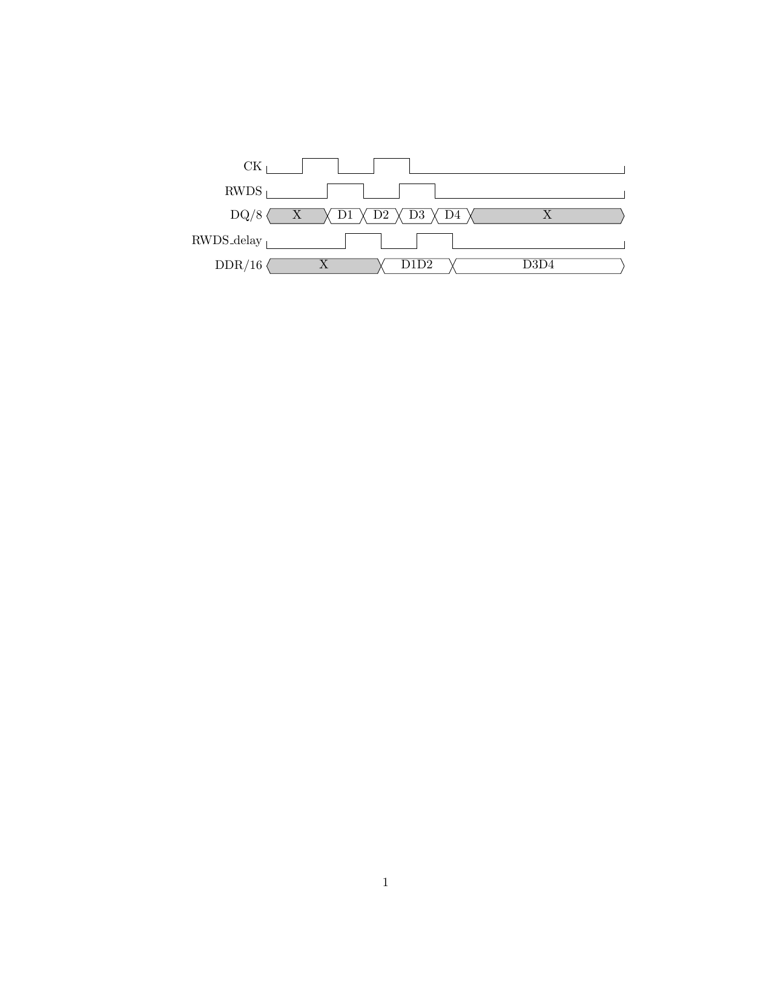
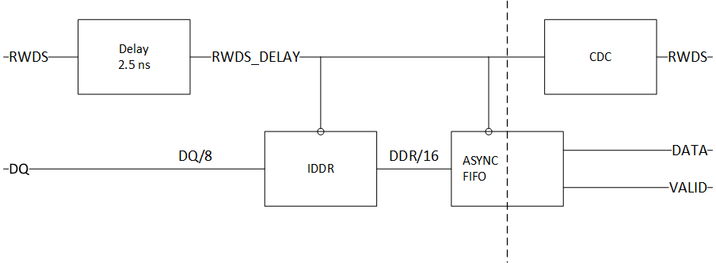

# Overview of HyperRAM controller

I've split the HyperRAM controller implementation into six parts, but it is
only the entity `hyperram` from the wrapper file ([hyperram.vhd](hyperram.vhd))
that you need to use when working with the controller.

The six parts are:

* The state machine ([`hyperram_ctrl.vhd`](hyperram_ctrl.vhd)), running in a
  single clock domain, same as HyperRAM device, i.e. 100 MHz.
* The transmit path ([`hyperram_tx.vhd`](hyperram_tx.vhd)), using one additional
  clock at 100 MHz that is phase shifted 90 degrees.
* The receive path ([`hyperram_rx.vhd`](hyperram_rx.vhd)), using one additional
  clock at 200 MHz for controlling the input delay.
* A custom-made shallow (two-element) asynchronous FIFO
  ([`hyperram_fifo.vhd`](hyperram_fifo.vhd)) that is used as part of the receive path.
* The initial configuration of the HyperRAM
  ([`hyperram_config.vhd`](hyperram_config.vhd)), used to set up e.g. the latency mode.
* An optional fix for an errata
  ([`hyperram_errata.vhd`](hyperram_errata.vhd)) that is relevant for ISSI revision D
  dies.

The above six entities are described in more detail in the following:

## `hyperram_config.vhd`

This is the HyperRAM "configurator".
It performs two functions:

* Wait until the HyperRAM device is operational after reset.
* Perform a write to configuration register 0 to set the latency mode to "variable".

I've chosen to implement it as an Avalon MM "sandwich" to be connected directly
between the client and the main state machine. This makes it very easy to pull
out this module if your design requires that.

## `hyperram_errata.vhd`

This is an optional errata fix. It's sole purpose is to work around a bug
in the ISSI revision D dies.

The bug causes all single-word writes to fail (not committed to memory). The fix is to
convert these to double-word writes, where the second word has byte-enable set to false.

This module is also implemented as an Avalon MM "sandwich" to be connected directly
between the client and the main state machine. This makes it very easy to pull out this
module if your design requires that. Currently, it's presence is controlled by the
top-level generic `G_ERRATA_ISSI_D_FIX`, which is default true.

## `hyperram_ctrl.vhd`

This is the main state machine of the HyperRAM controller.  The purpose is to implement
the HyperBus protocol, i.e.  to decode the Avalon MM requests and generate the control
signals for the HyperRAM device.

The user interface to the HyperRAM controller is a 16-bit [Avalon Memory
Map](../../doc/Avalon_Interface_Specifications.pdf) interface with support for burst
operations.  This is a very common bus interface, and quite easy to use.

## `hyperram_tx.vhd`
This handles the transmit data, i.e. the path from the HyperRAM controller to the device.
It uses one additional clock at 100 MHz that is phase shifted 90 degrees.

The phase shifted clock is used to delay the HyperRAM clock signal `CK` relative to the
transitions on the output `DQ` signal. This ensures correct values of the timing
parameters `t_IS` and `t_IH` during WRITE operation, see later section on Timing
Parameters.

## `hyperram_rx.vhd`
This handles the receive data, i.e. the path from the HyperRAM device to the controller.
It uses one additional clock at 200 MHz for controlling the input delay.  Data from the
HyperRAM device arrives synchronuous with the RWDS signal.  In other words, the RWDS
signal functions as a clock, except it is not free-running.

The RWDS signal has a second purpose as well, in that it indicates the latency of the
current transaction. The RWDS signal is therefore fed to the main HyperRAM controller as a
data signal as well.

The receive path delays the `RWDS` signal by 90 degrees using an IDELAY primitive, and
then uses this as a clock signal to sample the `DQ` input, see the following timing diagram:



The receive path is shown in the following block diagram.



The output of the IDDR block is synchronous with the RWDS signal, so we feed the output
into an asynchronous FIFO, see the following.

However, since the RWDS signal is not free-running, we are "missing" a clock pulse needed
by the FIFO. This is overcome by reading one extra word from memory (sending one more
clock pulse on the CK pin), and then skipping the first word out of the FIFO.

## `hyperram_fifo.vhd`

This is a shallow (two-element) asynchronous FIFO. The input and output data rates are
assumed to be the same (100 MHz), so the only purpose is to generate an output that is
synchronous to the main clock of the controller.

Writing to the FIFO stores the data alternately in two difference sets of input registers.
This guarantees that each input register is stable for at least two clock cycles. The
current write pointer is encoded as a two-bit gray code.  The gray code ensures that each
bit in the write pointer is stable for at least two clock cycles as well.

The write pointer and input registers are then transferred to the main clock domain, with
the extra caveat that the write pointer has an extra synchronization register (three
instead of two).

## Timing Parameters

The timing parameters are given in the table below (taken from Table 10.3 of the
[documentation](../../doc/66-67WVH8M8ALL-BLL-938852.pdf)):

```
Parameter                                | Symbol | Min  | Max  | Unit
Chip Select High Between Transactions    | t_CSHI | 10.0 |  -   | ns
HyperRAM Read-Write Recovery Time        | t_RWR  | 40   |  -   | ns
Chip Select Setup to next CK Rising Edge | t_CSS  |  3   |  -   | ns
Data Strobe Valid                        | t_DSV  |  -   | 12   | ns
Input Setup                              | t_IS   |  1.0 |  -   | ns
Input Hold                               | t_IH   |  1.0 |  -   | ns
HyperRAM Read Initial Access Time        | t_ACC  | 40   |  -   | ns
Clock to DQs Low Z                       | t_DQLZ |  0   |  -   | ns
HyperRAM CK transition to DQ Valid       | t_CKD  |  1   |  7   | ns
HyperRAM CK transition to DQ Invalid     | t_CKDI |  0.5 |  5.2 | ns
Data Valid                               | t_DV   |  2.7 |  -   | ns
CK transition to RWDS valid              | t_CKDS |  1   |  7   | ns
RWDS transition to DQ Valid              | t_DSS  | -0.8 |  0.8 | ns
RWDS transition to DQ Invalid            | t_DSH  | -0.8 |  0.8 | ns
Chip Select Hold After CK Falling Edge   | t_CSH  | 0    |  -   | ns
Chip Select Inactive to RWDS High-Z      | t_DSZ  | -    |  7   | ns
Chip Select Inactive to DQ High-Z        | t_OZ   | -    |  7   | ns
HyperRAM Chip Select Maximum Low Time    | t_CSM  | -    |  4.0 | us
Refresh Time                             | t_RFH  | 40   |  -   | ns
```

The symbol names refer to the following figure (taken from the [Cypress HyperRAM datasheet](../../doc/s27kl0642.pdf)):


